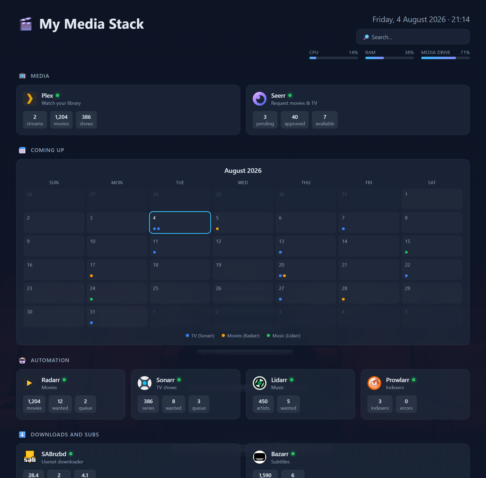
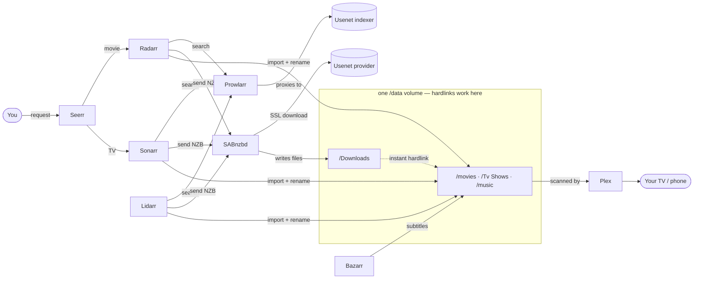

# 🎬 Plex Usenet Media Stack

[](https://github.com/alex4nder1998/docker-plex-arr-usenet/actions/workflows/validate.yml)
[](LICENSE)
[](docker-compose.yml)
[](CONTRIBUTING.md)
[](#-why-usenet-no-vpn)
[](#-prerequisites)

A complete, self-hosted media automation stack in Docker — **Plex + the \*arr suite + Usenet**, with all the real-world gotchas already fixed. Search, download, organize, and stream Movies, TV, and Music with a single click.

> **No VPN required.** This stack is built around **Usenet** (direct SSL, no swarm/peers), so there's nothing to hide from and nothing to leak. An optional torrent path with a VPN kill-switch is included but commented out.

<p align="center">
  
  <br><em>The included Homepage dashboard — one page for the whole stack.</em>
</p>

---

## 📑 Contents

- [What's in the box](#-whats-in-the-box)
- [How it works](#-how-it-works)
- [Why Usenet (no VPN)](#-why-usenet-no-vpn)
- [Prerequisites](#-prerequisites)
- [Quick start](#-quick-start)
- [Full documentation](#-full-documentation)
- [The hard-won fixes](#-the-hard-won-fixes-why-this-stack-just-works)
- [Repo structure](#-repo-structure)
- [FAQ](#-faq)
- [Optional: torrents with a VPN kill-switch](#-optional-torrents-with-a-vpn-kill-switch)
- [Credits](#-credits--acknowledgements)
- [Legal](#-legal-note)

---

## 📦 What's in the box

| Service | Port | Role |
|---|---|---|
| **Plex** | 32400 | Watch your library |
| **Seerr** | 5055 | Netflix-style request page (successor to Overseerr) |
| **Radarr** | 7878 | Movies |
| **Sonarr** | 8989 | TV |
| **Lidarr** | 8686 | Music |
| **Prowlarr** | 9696 | Indexer manager (feeds all \*arr apps) |
| **SABnzbd** | 8080 | Usenet downloader |
| **Bazarr** | 6767 | Subtitles |
| **Homepage** | 3000 | Unified dashboard for everything |

**Optional extras** (in `docker-compose.yml`, all run *alongside* the above — enable what you want):

| Service | Port | Role |
|---|---|---|
| **Jellyfin** | 8096 | Free, open-source media server (full Plex alternative) |
| **Navidrome** | 4533 | Free music server — pairs with mobile apps like Amperfy |
| **MeTube** | 8082 | `yt-dlp` web UI to grab specific songs/videos into the music library |

---

## 🔁 How it works



**In words:** Request in Seerr → the \*arr app searches your indexer **through Prowlarr** → it sends the NZB to SABnzbd → SABnzbd downloads from Usenet over SSL into **`/data/Downloads`** → the \*arr app **hardlinks** that file into the library (same volume = instant, zero extra space) → Bazarr adds subtitles → Plex scans → you watch.

---

## 🔒 Why Usenet (no VPN)

| | **Usenet** (this stack) | **Torrents** |
|---|---|---|
| Privacy | Direct SSL to one provider — no peers see your IP | You join a swarm; every peer sees your IP |
| VPN needed? | **No** | **Yes** (or you're exposed) |
| Speed | Maxes your connection, consistently | Depends on seeders |
| Retention | Years of back-catalog on good providers | Dies when seeders leave |
| Cost | ~$5–8/mo provider + indexer | VPN ~$5/mo |

That's the whole reason this stack defaults to Usenet: **simpler, faster, and nothing to leak.** Torrents are still available (with a mandatory VPN kill-switch) if you want them — see [below](#-optional-torrents-with-a-vpn-kill-switch).

---

## ✅ Prerequisites

1. **Docker + Docker Compose** (Docker Desktop on Windows/Mac, or Docker Engine on Linux).
2. **A drive for your media** with a single top-level folder (e.g. `/data` or `E:\Media`) containing `movies`, `Tv Shows`, `music`, `Downloads`, `incomplete`.
3. **A Usenet provider** (unlimited ~$5–8/mo, or a cheap block account). Cheap option: [Frugal Usenet](https://www.frugalusenet.com).
4. **A Usenet indexer** — e.g. [NZBGeek](https://nzbgeek.info) (needs a VIP membership for API access) or NZBFinder.
5. *(Optional)* A Plex account for the claim token: https://www.plex.tv/claim/

---

## 🚀 Quick start

```bash
git clone https://github.com/alex4nder1998/docker-plex-arr-usenet.git
cd docker-plex-arr-usenet
cp .env.example .env
# edit .env — set your paths, timezone, and (optionally) Plex claim token
docker compose up -d
```

Then finish setup. The apps talk to each other by container name on a shared Docker network, so URLs between them are things like `http://sonarr:8989`.

> 📖 **New here? Follow the [full step-by-step walkthrough](docs/SETUP.md) — every app, every setting, every value.**

---

## 📚 Full documentation

| Doc | What it covers |
|---|---|
| **[docs/SETUP.md](docs/SETUP.md)** | Complete, reproducible walkthrough from zero → streaming (~30 min) |
| **[docs/TROUBLESHOOTING.md](docs/TROUBLESHOOTING.md)** | Every real issue this stack hits and its exact fix |
| **[docs/custom-formats.md](docs/custom-formats.md)** | English-only custom format, SABnzbd repair settings, Plex Direct Play |
| **[docs/remote-access.md](docs/remote-access.md)** | Reach your stack / share Seerr safely (Tailscale, Cloudflare Tunnel) |
| **[SECURITY.md](SECURITY.md)** | Locking it down — app auth, API keys, what never to expose |

**Condensed config order** (the full version is in [SETUP.md](docs/SETUP.md)):

1. **SABnzbd** (`:8080`) → add your provider (host, **port 563 SSL**, login), set folders `/data/Downloads` + `/data/incomplete`, create categories `radarr`/`sonarr`/`lidarr`.
2. **Prowlarr** (`:9696`) → add your indexer (API key) → Settings → Apps → add Radarr/Sonarr/Lidarr. Indexers sync to all three.
3. **Radarr / Sonarr / Lidarr** → **Use Hardlinks = ON**, set a Recycling Bin, add SABnzbd as the download client, set root folders.
4. **Plex** (`:32400/web`) → add libraries at `/data/movies`, `/data/Tv Shows`, `/data/music`; add `172.20.0.0/16` to LAN Networks.
5. **Seerr** (`:5055`) → sign in with Plex → connect Radarr & Sonarr.
6. **Bazarr** (`:6767`) → connect Sonarr/Radarr + providers + a language profile.
7. **Homepage** (`:3000`) → drop each app's API key into `services.yaml`.

---

## 🖥 Dashboard (Homepage)

[Homepage](https://gethomepage.dev) gives you one page for the whole stack at `http://localhost:3000`:

- **Live widgets** — SABnzbd download speed/queue, Radarr & Sonarr queues, Prowlarr indexer health, Seerr pending requests, Bazarr missing subs.
- **Upcoming-releases calendar** — an agenda of what's airing/releasing next, pulled straight from Sonarr, Radarr, and Lidarr.
- **Status dots** — green/red per service via `siteMonitor`, so you see instantly if something's down.
- **System + media-drive usage** — CPU/RAM plus how full your media drive is (mount `${DATA_ROOT}:/media:ro` into the container).
- **Greeting, clock, quick search, and bookmarks** to your accounts and guides.

Reproduce it by copying the four files in [`examples/homepage/`](examples/homepage/) into `${CONFIG_ROOT}/homepage/` and pasting your API keys. Homepage hot-reloads on save.

> **Port tip:** if something else on your machine already uses `3000` (a common dev-server port), change Homepage's mapping to e.g. `7575:3000` and set `HOMEPAGE_ALLOWED_HOSTS` to match. Also note Windows resolves `localhost` to IPv6 first — if a page looks wrong, try `http://127.0.0.1:<port>`.

---

## 🔑 The hard-won fixes (why this stack "just works")

These are the non-obvious things that break naïve setups. They're already handled here:

- **Single `/data` mount = working hardlinks.** All download + library folders live under one mounted volume, so Radarr/Sonarr **hardlink** (instant, zero extra space) instead of copying and leaving orphans. Never split `/downloads` and `/movies` into separate mounts.
- **English-only (or your language).** A "No English Audio" custom format (score `-1000`) is documented so you never grab a foreign-audio release by accident. See [docs/custom-formats.md](docs/custom-formats.md).
- **Plex Direct Play behind Docker.** In a bridge network, Plex sees every client as the gateway IP (`172.20.0.1`) and treats your **LAN Apple TV/phone as *remote* → transcodes**. Fix: add your Docker subnet (e.g. `172.20.0.0/16`) to **Plex → Settings → Network → LAN Networks**. (Also: pick a client-friendly audio track — Apple TV can't Direct-Play TrueHD/Atmos.)
- **Broken downloads don't jam the queue.** SABnzbd `fail_hopeless_jobs=1` + category post-processing `Repair+Unpack+Delete`, so incomplete Usenet jobs **fail cleanly** and the \*arr app auto-blocklists + retries — instead of leaving 0-byte files stuck as "importBlocked".
- **Seerr, not Overseerr.** Overseerr/Jellyseerr merged into **Seerr** (2026). On Windows Docker bind mounts, Seerr needs `user: "0:0"` or it crash-loops with `EACCES` on `/app/config/logs`.

---

## 🗂 Repo structure

```
.
├── docker-compose.yml          # the whole stack (torrent path commented out)
├── .env.example                # copy to .env and fill in
├── .gitignore                  # keeps secrets & config/ out of git
├── LICENSE                     # MIT
├── README.md                   # you are here
├── CONTRIBUTING.md             # how to propose changes
├── DISCLAIMER.md               # legal / not-affiliated notice
├── SECURITY.md                 # locking down your instance
├── .github/workflows/
│   └── validate.yml            # CI: validates the compose file
├── docs/
│   ├── SETUP.md                # full step-by-step walkthrough
│   ├── TROUBLESHOOTING.md      # every issue + fix
│   ├── custom-formats.md       # custom formats & key settings
│   ├── remote-access.md        # Tailscale / Cloudflare / sharing
│   └── dashboard.png           # the hero screenshot
└── examples/
    └── homepage/               # dashboard config (API-key placeholders)
        ├── services.yaml       # service tiles + live widgets
        ├── settings.yaml       # theme, layout, status dots
        ├── widgets.yaml        # greeting, clock, search, disk usage
        └── bookmarks.yaml      # account & guide links
```

---

## ❓ FAQ

**Do I really not need a VPN?**
Correct — Usenet is a direct SSL connection to one provider, not a peer swarm. Nobody else sees your traffic. (If you enable the optional torrent path, then yes, use the included VPN kill-switch.)

**Can I use Jellyfin or Emby instead of Plex?**
Yes — swap the `plex` service for `jellyfin`/`emby` and point Seerr/Homepage at it. The \*arr + Usenet half is identical.

**Windows, Mac, or Linux?**
All three. Paths in `.env` differ (`E:\Media` vs `/mnt/media`); on Windows Docker Desktop, leave `PUID`/`PGID` at `1000` and keep Seerr's `user: "0:0"`.

**How do I update everything?**
`docker compose pull && docker compose up -d`. Configs persist in `CONFIG_ROOT`.

**Where are my API keys?**
Each app → **Settings → General → Security → API Key**.

**It downloaded a foreign-language release — how do I stop that?**
Add the "No English Audio" custom format — [docs/custom-formats.md](docs/custom-formats.md).

---

## 🌐 Optional: torrents with a VPN kill-switch

If you also want torrents (for content Usenet lacks), uncomment the **`gluetun`** and **`qbittorrent`** services in `docker-compose.yml`. qBittorrent routes **all** traffic through Gluetun (`network_mode: service:gluetun`) with `depends_on: gluetun (healthy)` — so it **physically cannot run or leak without the VPN up**. Add your WireGuard config to `.env`. Recommended provider: Mullvad (flat €5/mo, anonymous). Then in Sonarr/Radarr, set the qBittorrent download-client **host to `gluetun`**.

---

## 🤝 Contributing

Issues and pull requests are welcome!

- **Found a bug or a gotcha?** [Open an issue](../../issues/new/choose) — there are templates for bug reports and feature requests (they'll remind you to redact API keys).
- **Have a fix or improvement?** Open a PR — see [CONTRIBUTING.md](CONTRIBUTING.md). The CI checks the compose file automatically.

---

## 🙏 Credits & acknowledgements

Built on the shoulders of the self-hosting community:

- [**Servarr**](https://wiki.servarr.com) — Radarr, Sonarr, Lidarr, Prowlarr, and the canonical [hardlink/Docker guide](https://wiki.servarr.com/docker-guide).
- [**TRaSH-Guides**](https://trash-guides.info) — the single-mount `/data` layout and quality/custom-format best practices.
- [**LinuxServer.io**](https://www.linuxserver.io) — the container images most of this stack runs on.
- [**Seerr**](https://github.com/seerr-team/seerr), [**SABnzbd**](https://sabnzbd.org), [**Bazarr**](https://www.bazarr.media), [**Plex**](https://www.plex.tv), and [**gethomepage**](https://gethomepage.dev).

---

## ⚠️ Legal & disclaimer

This repo is **infrastructure tooling only** — Compose files, `.env` templates, and docs. It contains **no** copyrighted media, **no** pre-configured indexers/trackers, and **no** third-party binaries; it just orchestrates independent open-source apps. Use it for media you **own or are legally entitled to access**. Downloading/sharing copyrighted material without authorization may be illegal where you live — that's on you.

Any providers/indexers named here are **legitimate paid services**, given only as examples. This project is **not affiliated with or endorsed by** Plex, Sonarr, Radarr, Prowlarr, SABnzbd, Bazarr, Seerr, gethomepage, or any referenced project; trademarks belong to their owners (nominative fair use).

**Full text: [DISCLAIMER.md](DISCLAIMER.md).**

## License

MIT — see [LICENSE](LICENSE).
